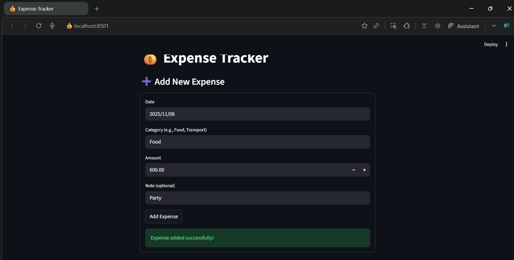
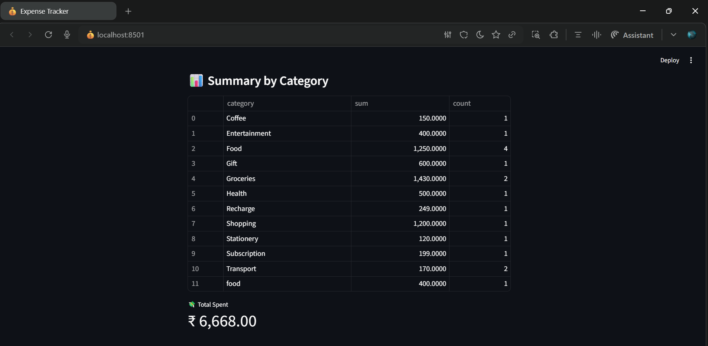

# 💰 Expense Tracker CLI

A simple **Python-based Expense Tracker** that lets you record, view, and analyze your daily spending data.

---

## ⚙️ Features
- Add new expenses with date, category, and note  
- View all or recent expenses  
- Category-wise expense summary  
- CSV-based data persistence  
- Optional Streamlit Web UI  

---

## 🧠 Tech Stack
- Python 🐍  
- Pandas  
- Streamlit

  ## 📸 Project Preview

**Web Version:**


**CLI Version:**


💡 Built with ❤️ by [Vanisha Nair](https://github.com/Vanii1007)

---

## 🚀 Run the Project
### CLI version:
```bash
python expense_tracker.py

---
